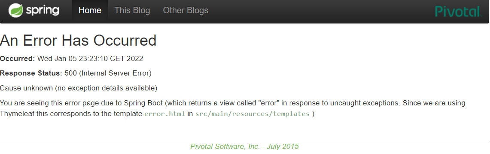

# Running and registering the two services

In order to register the `web` and `account` services, we will first deploy the discovery `registration` service
using the command `gradlew :registration:bootRun` as we can see in the following image:

So now, we can access its dashboard by opening `http://localhost:1111/` from a browser:

Once the `registration` service has been successfully deployed, it is time to run both services (`web` and `accounts`)
using the following commands:

`gradlew :web:bootRun`
`gradlew :accounts:bootRun`

**The services will register themsevles automatically to Eureka.**

Accounts and web services will be deployed in `http://localhost:2222/` and `http://localhost:3333/` respectively.

Finally, if we reload `http://localhost:1111/`, we will see that both instances have been registered correctly:

# Running and registering a second accounts service instance

In order to start and register a second `accounts` service instance, we will change the port property to `4444` in
the `application.yml` file and deploy it using `gradlew :accounts:bootRun` in a new terminal. If we reload `http://localhost:1111/`
again, we will see that there is one more registered `accounts` service instance:

# Killing the service accounts (2222) and doing requests to web

If we kill one of the registered accounts instances, the web service will show an Internal Server Error for a few seconds.

However, the `registration` service will realize that one of the instances is no longer working. So, it will only use the other instance.

